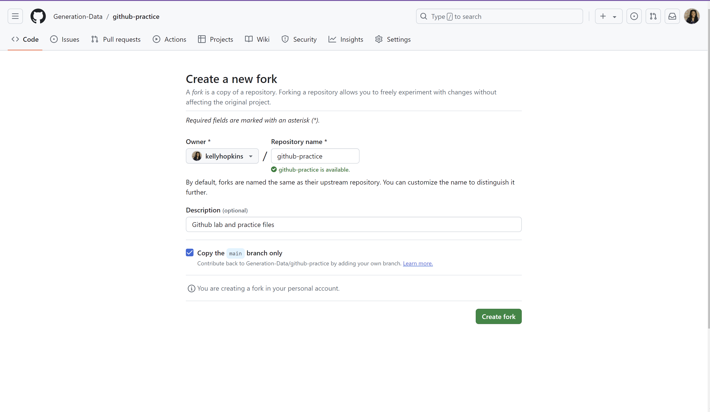
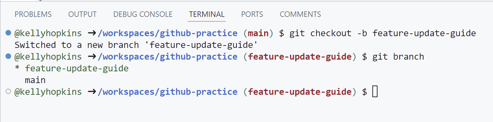

# Github Practice Activity - Data Privacy Toolkit

## Overview
This repository contains a guide on implementing data privacy standards within social movements and organizations. It was created to serve as a starter kit for organizations looking to bring similar standards to their work. These organizations can use the Data Privacy Guide as a starting point to start building their own policies. THe group maintainign this repository is actively maintaining this project and is regularly adding new tools and content for these organizations to use.

## Fork Activity

**Step 1. Create a fork of the Generation-Data/github-practice repository.**

At the top of this page, click the "Fork" button to start creating a fork of the repo.


On the "Create a new fork" page, take note of the following settings:



Click the "Create fork" button.

#### Examining Our New Fork

Take a look at the fork you just created. Notice that the repository is now `[your-github-id]/github-practice` instead of `Generation-Data/github-practice`.


**Step 2: Start a new codespace on the main branch of your forked repo.**

> Discussion: Take a look at the files in the repo. What kinds of files/folders are present and what are their purposes?

Open the data privacy guide at `guide/data-privacy.md`. Open the markdown preview window if it doesn't open automatically


Ensure that you're on the main branch by running:
```
git branch
```

Within your repo, you not only have access to the forked copy of the code you made, but also the code in the original repo as well. The site where a repo is hosted online is called a `remote`, and we pull and push new code to that new remote from our `local` code repo.

You can view the list of remotes for a given repo by running:
```
git remote
```

You can also add the `-v` flag to display a little more information about the remotes:
```
git remote -v
```

## Branch Activity

When using source control in software development, it is standard practice to keep your `main` branch as the most stable version of your code. If you want to test out some major changes that might make your code unstable, creating a branch is a great option for making a copy of your code and isolating those experimental changes fromt he rest of the repo.

**Step 1. Open the Data Privacy Guide at `guide/data-privacy.md`**.

Scroll down to the *Implementing Data Privacy Standards* section towards the end of the guide.

> As you can see, the example data privacy policy section is formatted as a code snippet. We want to change this formatting to a **block quote**, like this section, in order to render the heading sizes.

**Step 2. Create a branch named `feature-update-guide` in your forked repo.**

You can create a new branch in your repo on your codespace by running the command:
```
git checkout -b feature-update-guide
```

Run `git branch` to ensure that you've switched to your newly created branch:



**Step 3. In the `data-privacy.md` file, change the data privacy policy snippet to a block quote.**

Remove the markdown-formatted block and add a `>` symbol next to each line in the section. Your markdown file should look like this:

```markdown
### Example Data Privacy Policy (Snippet)


> ### Data Privacy Policy
> 
> #### Data Collection and Usage
>
> We collect personal data (e.g., names, email addresses) only with explicit consent and for specified purposes. Data is used solely for internal communication and organizing purposes.
>
> #### Data Security
> 
> All personal data is stored securely using industry-standard encryption methods. Access is restricted to authorized > personnel only.
> 
> #### Data Retention
> 
> We retain personal data only as long as necessary for organizational purposes or as required by law. Data will be securely deleted when no longer needed.
> 
> #### Consent and Rights
> 
> Individuals have the right to access, correct, or delete their personal data upon request. Consent can be withdrawn at any time.
```

Verify your changes in the preview window.

**Step 4. Add and commit your changes to the feature branch.**

Check status of changes on your branch:
```
git status
```

Stage the changes you made to `data-privacy.md` (multiple options):
```
git add .
```

**or**

```
git add guide/data-privacy.md
```

**or**

```
git add -u
```

**Step 5. Commit your changes with a descriptive commit message.**

```
git commit -m "Reformat data privacy example"
```

**Step 6. Push your commit on your new branch to your forked repo**

```
git push
```

You should get an error message like the one below:

```bash
@kellyhopkins ➜ /workspaces/github-practice (feature-update-guide) $ git push
fatal: The current branch feature-update-guide has no upstream branch.
To push the current branch and set the remote as upstream, use

    git push --set-upstream origin feature-update-guide

To have this happen automatically for branches without a tracking
upstream, see 'push.autoSetupRemote' in 'git help config'.
```

Publish your new branch by following the directions the the error message or pressing the "Publish Branch" button in the Source Control menu and selecting `origin` as the remote.

Verify your new branch in Github.


## Merge Activity

**Step 1. Merge your changes on your feature branch into your main branch.**

Switch back to your main branch:
```
git checkout main
```

Merge the feature branch into the main branch:
```
git merge feature-update-guide
```

Push your changes to the mian branch on `origin`:
```
git push
```
